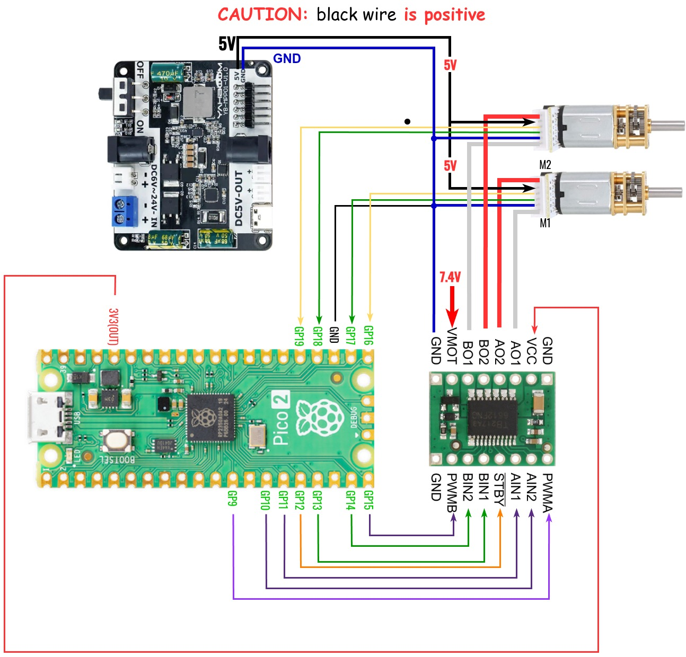

# 3421example-motor_control

## Example Wiring Diagram
### 1. Motors Only


### 2. Motors + Encoders


## Usage

Upload `.py` files from root of this repository to the Pico board.
>
> - [`motor_driver.py`](motor_driver.py)
> - [`dual_motor_driver.py`](dual_motor_driver.py)
> - [`encoded_motor_driver.py`](encoded_motor_driver.py)
> - [`sentient_wheel_driver.py`](sentient_wheel_driver.py)
> - [`wheel_controller.py`](wheel_controller.py)
> - [`diff_drive_controller.py`](diff_drive_controller.py)

Import the desired class to a **MicroPython** script to further develop it.

1. Spin a single motor:

```Python
from motor_driver import MotorDriver
```

2. Spin two motors together:

```Python
from dual_motor_driver import DualMotorDriver
```

3. Count encoder pulses:

```Python
from encoded_motor_driver import EncodedMotorDriver
```

4. Measure wheel linear and angular velocity:
```Python
from sentient_wheel_driver import SentientWheelDriver
```

5. Regulate wheel linear and angular velocity via PID control:
```Python
from wheel_controller import WheelController
```

6. Set and monitor velocity of the differential drive base:
```Python
from diff_drive_controller import DiffDriveController
```

